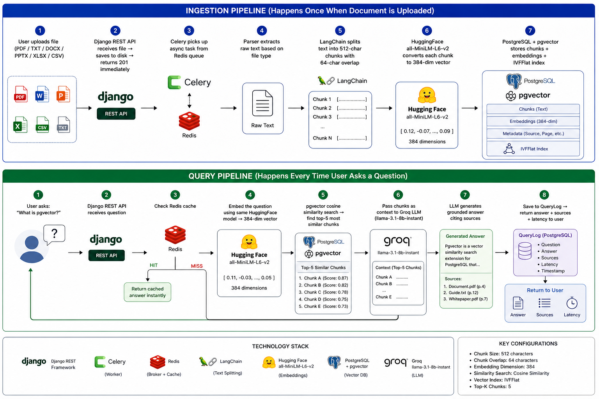
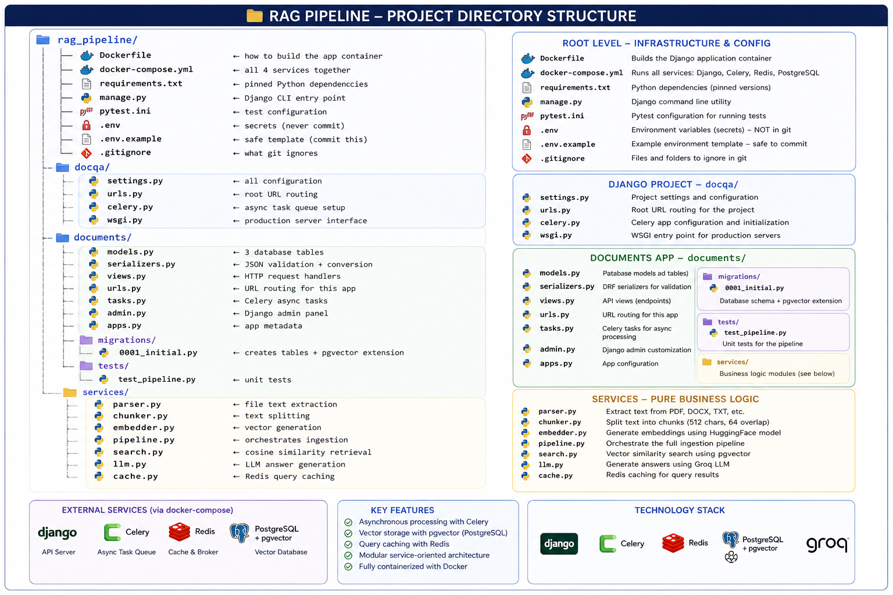
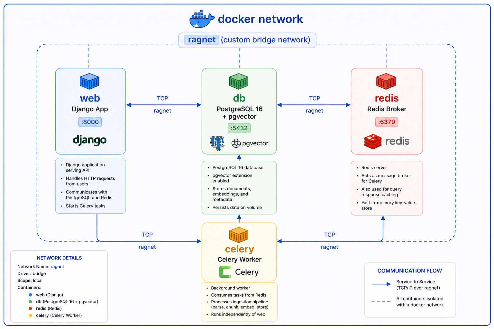
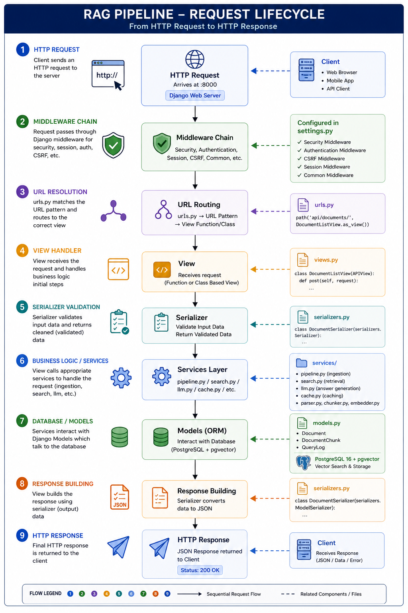
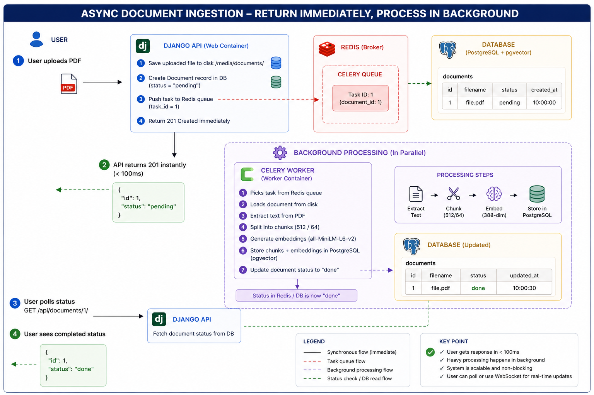
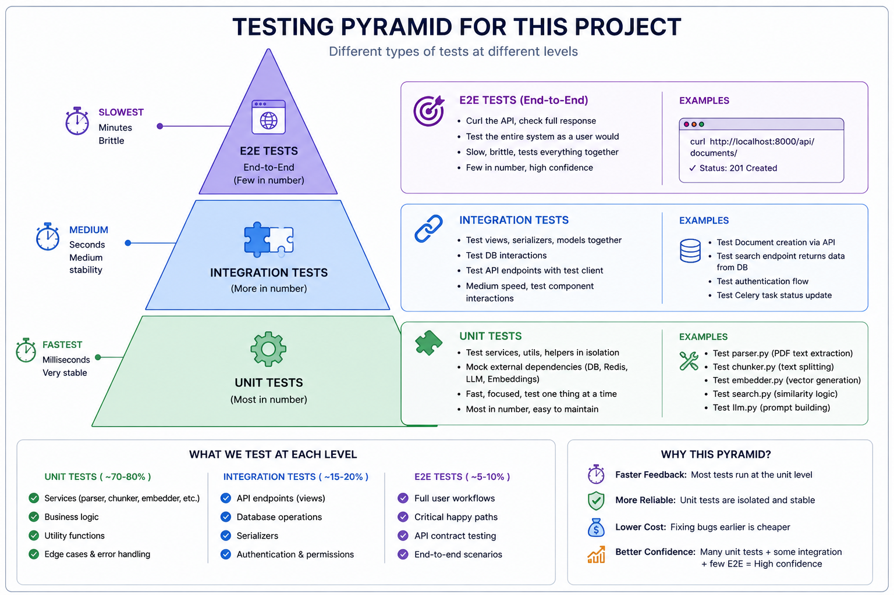
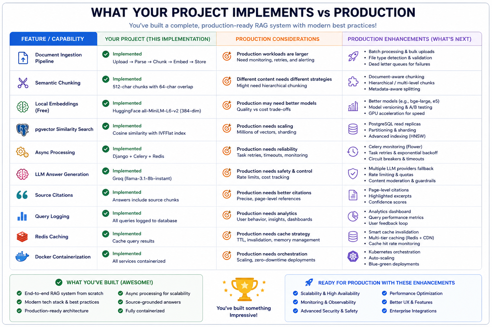

# 🧠 RAG Pipeline — Complete Engineering Notes

> A deep-dive reference covering every concept, decision, and lesson from building a production-grade Retrieval Augmented Generation system from scratch.

---

## 📋 Table of Contents

1. [What You Built](#-what-you-built)
2. [Project Structure](#-project-structure)
3. [Docker and Containerization](#-docker-and-containerization)
4. [Django Architecture](#-django-architecture)
5. [Async Processing with Celery](#-async-processing-with-celery)
6. [Chunking In Depth](#-chunking-in-depth)
7. [Embeddings In Depth](#-embeddings-in-depth)
8. [pgvector and Vector Search](#-pgvector-and-vector-search)
9. [LLM Integration](#-llm-integration)
10. [Redis Caching](#-redis-caching)
11. [File Parsing](#-file-parsing)
12. [Testing Strategy](#-testing-strategy)
13. [Production Considerations](#-production-considerations)
14. [What Production AI Systems Actually Do](#-what-production-ai-systems-actually-do)
15. [Key Numbers to Memorize](#-key-numbers-to-memorize)
16. [Common Bugs and Fixes](#-common-bugs-and-fixes)
17. [Architecture Summary](#-architecture-summary)

---

## 🏗 What You Built

You built a production-grade Document Q&A system from scratch.
A user uploads any document. The system reads it, breaks it into pieces,
converts each piece into numbers that capture meaning, and stores everything
in a database. When a user asks a question, the system finds the most
relevant pieces and passes them to an LLM which generates a precise answer.

This is called RAG — Retrieval Augmented Generation.
It is the same architecture used inside Notion AI, GitHub Copilot Chat,
Cursor, Perplexity, and every major enterprise AI product today.

The full pipeline you built:
INGESTION (happens once when document is uploaded)



---

## Part 1 — Project Structure Explained


Why the services/ folder exists:
Services contain pure business logic with no Django or HTTP knowledge.
pipeline.py does not know about HTTP requests.
chunker.py does not know about the database.
Each file has one job. This is called Single Responsibility Principle.
You can test each service in isolation without spinning up a web server.
You can swap chunker.py for a different strategy without touching views.py.

---

## Part 2 — Docker and Containerization

### What Docker actually does

Without Docker:
- You install Python 3.11 on your machine
- You install PostgreSQL on your machine
- You install Redis on your machine
- Your teammate installs Python 3.10 — subtle bugs appear
- You deploy to a server running Ubuntu 20 — different behavior again

With Docker:
- Everything runs in isolated containers
- Every container has exactly the same environment
- Your machine, your teammate's machine, and the production server
  all run identical environments
- "Works on my machine" becomes "works everywhere"

### Your 4 containers


web — runs Django development server. Handles HTTP requests.
db — runs PostgreSQL with pgvector extension. Stores all data.
redis — message broker. web pushes tasks here. celery reads from here.
celery — runs the background worker. Processes document ingestion.

WHY 4 separate containers?
Because they have different jobs, different scaling needs, and different
failure modes. If the celery worker crashes, Django still serves requests.
If you need more processing power, you run 5 celery workers, not 5 Django
servers. Separation of concerns at the infrastructure level.

### The Dockerfile explained line by line

```dockerfile
FROM python:3.11-slim
```
Start from an official Python 3.11 image on minimal Debian Linux.
slim = 50MB instead of 900MB. We don't need the full OS.

```dockerfile
ENV PYTHONDONTWRITEBYTECODE=1
ENV PYTHONUNBUFFERED=1
```
First: stop Python writing .pyc cache files — useless in containers.
Second: force Python to flush logs immediately so docker logs shows output.
Without this, logs get buffered and you see nothing while debugging.

```dockerfile
WORKDIR /app
```
All commands run from /app. Your project files live at /app/manage.py,
/app/docqa/settings.py etc.

```dockerfile
COPY requirements.txt .
RUN pip install --no-cache-dir -r requirements.txt
COPY . .
```
DELIBERATE ORDER. Docker caches each line as a layer.
If you copy code first, every code change rebuilds pip install (slow).
By copying requirements.txt first, pip only reruns when dependencies change.
Code changes only hit the fast final COPY layer.
This saves 2-3 minutes on every rebuild.

### The volume mount that enables live reload

```yaml
volumes:
  - .:/app
```
This mounts your local project folder into /app inside the container.
They are the SAME folder — not a copy.
Edit a file in VS Code → Django sees the change instantly.
This is why you don't need docker compose up after every code change.

### The healthcheck that prevents race conditions

```yaml
healthcheck:
  test: ["CMD-SHELL", "pg_isready -U docqa_user -d docqa_db"]
  interval: 5s
  retries: 5
```
PostgreSQL takes 3-5 seconds to start accepting connections after the
container starts. Without healthcheck, Django starts immediately, tries
to connect to Postgres, gets "connection refused", and crashes.
The healthcheck polls every 5 seconds and only marks db as "healthy"
when Postgres actually accepts connections.
depends_on: condition: service_healthy makes Django wait.

---

## Part 3 — Django Architecture

### Why Django over Flask

Flask is a microframework — you build everything yourself.
Django is a batteries-included framework — everything is built in.

For a production API you need: ORM, migrations, admin panel, auth,
serializers, validation, pagination, CORS, security middleware.
Flask requires a separate library for each. Django includes all of them.

For a RAG system with multiple models, async tasks, and an admin UI —
Django is the right choice.

### The request lifecycle


### Models — the database schema

```python
class Document(models.Model):
    title = models.CharField(max_length=255)
    file = models.FileField(upload_to='documents/')
    status = models.CharField(choices=STATUS_CHOICES, default='pending')
    metadata = models.JSONField(default=dict)
    created_at = models.DateTimeField(auto_now_add=True)
```
One row per uploaded file. status tracks pipeline progress.
pending → processing → done (or failed).
The API can always tell the user what stage their document is at.

```python
class DocumentChunk(models.Model):
    document = models.ForeignKey(Document, on_delete=models.CASCADE)
    chunk_index = models.IntegerField()
    content = models.TextField()
    embedding = VectorField(dimensions=384)
    metadata = models.JSONField(default=dict)
```
This is the core RAG table. One row per chunk.
embedding is a 384-float vector stored natively in PostgreSQL.
When a user asks a question, their question is also converted to 384 floats,
and pgvector finds the rows with the most similar embedding vectors.
That's the entire retrieval mechanism — one SQL query.

```python
class QueryLog(models.Model):
    query = models.TextField()
    answer = models.TextField(blank=True)
    retrieved_chunk_ids = models.JSONField(default=list)
    latency_ms = models.IntegerField(default=0)
    ragas_score = models.FloatField(null=True, blank=True)
    created_at = models.DateTimeField(auto_now_add=True)
```
Records every question, every answer, which chunks were used, how long
it took, and a quality score. This is your evaluation dataset.
Without QueryLog you can never answer "is the system getting better?".

### Why ViewSet over APIView

```python
class DocumentViewSet(viewsets.ModelViewSet):
    queryset = Document.objects.all().order_by('-created_at')
    serializer_class = DocumentSerializer
```
These 3 lines generate 5 endpoints automatically:
GET    /api/documents/        → list all
POST   /api/documents/        → create new
GET    /api/documents/{id}/   → get one
PUT    /api/documents/{id}/   → update
DELETE /api/documents/{id}/   → delete

ModelViewSet uses the DRY principle — Don't Repeat Yourself.
The alternative is writing each endpoint manually — 50+ lines per resource.

### Why Serializers

DRF Serializers do 3 things:
1. Validate incoming data (is title missing? is file too large?)
2. Convert model instances to JSON for responses
3. Handle computed fields like chunk_count that don't exist on the model

Without serializers you write this validation logic in every view.
With serializers you write it once and reuse it everywhere.

---

## Part 4 — Async Processing with Celery

### The problem Celery solves

Generating embeddings for a 50-page PDF takes 30-60 seconds.
If you do this inside the HTTP request, the user waits 60 seconds
staring at a loading spinner. The browser might timeout.
Your API appears broken.

The solution: return immediately, process in the background.



### How Celery actually works

.delay() is the key. It does NOT run the function.
It serializes the function name and arguments as JSON, pushes to Redis,
and returns immediately. Celery worker on the other side reads from Redis
and actually executes the function.

### Why max_retries=3 with countdown=10

```python
@shared_task(bind=True, max_retries=3)
def process_document_task(self, document_id: int):
    try:
        _process(document_id)
    except Exception as exc:
        raise self.retry(exc=exc, countdown=10)
```

Production reality: databases go down momentarily. Networks blip.
The embedding model might timeout once. These are transient failures.
With retries: task fails → wait 10 seconds → try again → usually succeeds.
Without retries: one network blip = document permanently stuck as "failed".
Users have to manually reprocess. Bad UX.

### transaction.atomic() — the safety guarantee

```python
with transaction.atomic():
    doc = Document.objects.create(...)
    chunks = chunk_document(text)
    embeddings = embed_texts(texts)  # if this fails...
    DocumentChunk.objects.bulk_create(...)  # this never runs
```

atomic() means: ALL operations succeed, or NONE of them do.
If embed_texts() raises an exception, the Document row is rolled back.
The database is always in a consistent state.
Without atomic(): embed fails → Document exists with no chunks → orphan data.
This is the banking principle: transfer money = debit AND credit.
If credit fails, debit must roll back.

---

## Part 5 — Chunking In Depth

### Why chunking is necessary

LLMs have a context window — a maximum number of tokens they can read
at once. GPT-4: 128K tokens. Llama 3.1: 8K tokens.
A 100-page PDF is ~50,000 words = ~65,000 tokens.
It doesn't fit. You must retrieve only the relevant parts.

Chunking splits the document into pieces small enough to fit in context.
RAG then selects only the relevant pieces for each query.

### RecursiveCharacterTextSplitter settings

```python
chunk_size=512        # max characters per chunk
chunk_overlap=64      # characters shared between adjacent chunks
separators=["\n\n", "\n", ". ", " ", ""]
```

chunk_size=512: roughly 80-100 words. Large enough to contain a complete
thought. Small enough to be precise when retrieved.
Too small (50 chars): chunks lack context, retrieval is noisy.
Too large (2000 chars): chunks contain multiple topics, retrieval imprecise.

chunk_overlap=64: prevents information loss at boundaries.
Without overlap:
  Chunk 1: "Django ORM supports multiple databases."
  Chunk 2: "PostgreSQL, MySQL, and SQLite are supported."
  Question "what databases does Django ORM support?" → chunk 2 retrieved
  but chunk 2 doesn't mention "Django ORM" — context is lost.
With overlap:
  Chunk 2 starts 64 chars before its boundary so it includes "ORM supports"
  Context preserved.

separators tries each in order:
  \n\n → paragraph boundary (most natural — try this first)
  \n   → line break
  .    → sentence end
  " "  → word boundary
  ""   → character (never split mid-word if avoidable)

Result: chunks always end at natural language boundaries.

### What gets stored per chunk
DocumentChunk row:
chunk_index: 3
content: "pgvector adds vector similarity search to PostgreSQL.
It stores vectors as native column types and provides
operators for distance calculation."
embedding: [0.12, -0.45, 0.89, 0.23, -0.11, ...]  ← 384 floats
metadata: {
"embedding_model": "all-MiniLM-L6-v2",
"char_count": 187
}

The metadata.embedding_model field is critical.
If you later upgrade from all-MiniLM-L6-v2 to a better model,
old chunks were embedded with the old model.
Comparing old 384-dim vectors with new 384-dim vectors from a different
model gives garbage similarity scores — the numbers mean different things.
Storing the model name lets you detect stale embeddings and re-process.

---

## Part 6 — Embeddings In Depth

### What an embedding actually is

An embedding is a point in high-dimensional space.
384 dimensions means a point in 384-dimensional space.
Each dimension captures some aspect of meaning.

You can't visualize 384 dimensions but imagine 3D for intuition:
  "cat"    → point at (0.2, 0.8, 0.1)
  "dog"    → point at (0.3, 0.7, 0.2)  ← close to cat
  "table"  → point at (0.9, 0.1, 0.8)  ← far from cat

Similar meanings → nearby points.
Different meanings → distant points.

In 384 dimensions, the model can encode much more nuanced relationships
than this 3D example. Synonyms, antonyms, topics, tone, domain — all
encoded in the relative positions of these 384-dimensional points.

### The all-MiniLM-L6-v2 model

Architecture: 6-layer transformer (BERT-style)
Training: Contrastive learning on 1 billion sentence pairs
Task trained for: Given sentence A and sentence B, their embeddings
should be close if they mean the same thing, far if they don't.
Output: 384-float normalized vector (magnitude = 1.0)
Size: ~90MB
Speed: ~500 chunks/second on CPU
Quality: Excellent for English semantic similarity

L6 means 6 transformer layers. More layers = more capacity to learn
subtle relationships but slower inference. L6 is the production sweet spot.

The model is loaded ONCE when the Celery worker starts — singleton pattern:

```python
_model = None

def get_model():
    global _model
    if _model is None:
        _model = SentenceTransformer('all-MiniLM-L6-v2')
        # First call: 90MB download + 3-5 second load
        # Every subsequent call: instant, reuses loaded model
    return _model
```

Without singleton: model reloads on every function call.
200 chunks = 200 × 5 second loads = 1000 seconds.
With singleton: model loads once = 5 seconds total regardless of chunk count.

### Why we use batch encoding

```python
embeddings = model.encode(
    texts,          # all chunks at once
    batch_size=32,  # process 32 at a time
)
```

Instead of: for text in texts: embed(text)  ← 200 separate calls
We do: embed(all_texts)  ← 1 batched call

The transformer model is highly optimized for batched inference.
Processing 32 texts simultaneously takes roughly the same time as
processing 1 text. Batching gives near-linear throughput improvement.

### Cosine similarity vs other distance metrics

Three common distance metrics for vectors:

L2 (Euclidean): measures straight-line distance between points.
  Cares about magnitude (how long the vectors are).
  Problem: "car" and "CAR" might have different magnitudes.

Dot product: measures alignment considering magnitude.
  Fast but biased toward longer vectors.

Cosine: measures the angle between vectors, ignores magnitude.
  "car" and "CAR" have the same angle → same similarity.
  Best for text where we care about direction (meaning) not magnitude (length).

all-MiniLM-L6-v2 outputs normalized vectors (magnitude = 1.0).
For normalized vectors, cosine and dot product give identical rankings.
We use cosine explicitly for clarity when we switch to unnormalized models.

Cosine distance = 1 - cosine similarity
  distance 0.0 = identical meaning
  distance 0.5 = somewhat related
  distance 1.0 = completely unrelated
  distance > 1.0 = opposite meaning

Your search filter: distance__lt=0.7 means "only return chunks with
cosine distance less than 0.7" = similarity greater than 0.3.
Chunks with distance > 0.7 are probably irrelevant noise.

---

## Part 7 — pgvector and Vector Search

### Why PostgreSQL instead of a dedicated vector database

Dedicated vector databases (Pinecone, Qdrant, Weaviate):
  + Optimized purely for vector search
  + Sub-10ms queries at billion-vector scale
  + Managed infrastructure, no ops work
  - Separate service to manage and pay for
  - No SQL — can't join with your relational data
  - Complex to filter by user_id, date, document_id

pgvector in PostgreSQL:
  + Single database for all your data — vectors + relational
  + Full SQL power: WHERE document_id=1 AND distance < 0.7
  + You already have PostgreSQL — no new service
  + Scales comfortably to 5 million+ vectors
  - Not as fast as specialized DBs at extreme scale
  - You manage the infrastructure

For your project (and most real-world RAG projects):
pgvector is the right choice. Most startups building RAG don't have
a billion vectors. They have millions. pgvector handles that easily.

### How the IVFFlat index works

Without index — brute force scan:
  Query arrives → compare against every single row → return closest 5
  10,000 chunks = 10,000 comparisons
  1,000,000 chunks = 1,000,000 comparisons
  Linear time: O(n). Gets slower as you add data.

With IVFFlat index (Inverted File Flat):
  During index creation: cluster all vectors into 100 groups using k-means
  During search: find the 1-2 closest cluster centroids → search only those clusters
  1,000,000 chunks → search only ~20,000 (2% of data) → still finds 95%+ of results
  Much faster: roughly O(√n)

lists=100 parameter: number of clusters.
  Rule: lists = total_rows / 1000
  100 lists = optimal for up to 100,000 chunks
  1000 lists = optimal for up to 1,000,000 chunks

Trade-off: IVFFlat is APPROXIMATE — it might miss the best result 5% of
the time to be 100x faster. For RAG this is acceptable.
If you need exact results: use HNSW index (slower build, faster query).

### The cosine search query

```python
from pgvector.django import CosineDistance

chunks = (
    DocumentChunk.objects
    .annotate(distance=CosineDistance('embedding', query_embedding))
    .order_by('distance')
    .filter(distance__lt=0.7)
    [:5]
)
```

Translates to SQL:
  SELECT *, (embedding <=> '[0.12,-0.45,...]') AS distance
  FROM documents_documentchunk
  WHERE (embedding <=> '[0.12,-0.45,...]') < 0.7
  ORDER BY distance
  LIMIT 5;

The <=> operator is pgvector's cosine distance operator.
The IVFFlat index makes this query fast by only scanning relevant clusters.

---

## Part 8 — The LLM Integration

### Why Groq instead of OpenAI

OpenAI GPT-4o-mini: $0.15/1M tokens, requires paid account
Groq llama-3.1-8b-instant: Free tier, 14,400 requests/day, very fast

For RAG specifically, the LLM's job is simple:
Read 5 short paragraphs → synthesize an answer → cite sources.
This does NOT require frontier model capability.
Llama 3.1 8B is more than capable for this task.

At production scale, the embedding model quality matters more than
the LLM quality in RAG systems. Better retrieval → better answers,
regardless of which LLM you use.

### Why temperature=0

Temperature controls randomness in LLM output.
temperature=0: deterministic — same input → same output every time.
temperature=1: creative — different output every run.

For Q&A you want deterministic answers:
- Same question → same answer → easy to test
- Consistent behavior → users trust the system
- Easy to cache (same question = same cached answer)
- Easier to debug (behavior is reproducible)

### The system prompt design
"Answer using ONLY the provided sources.
If the answer is not in the sources, say 'I don't have enough information.'
Cite sources like: According to [Source 1]..."

Three constraints:
1. ONLY the sources — prevents hallucination from training data
2. Admit ignorance — prevents making up answers when context is missing
3. Cite sources — makes answers verifiable, builds user trust

This is called "grounding". The LLM is grounded to the retrieved context.
Without grounding: LLM generates plausible-sounding but possibly wrong answers.
With grounding: LLM can only use what you retrieved. Errors are traceable.

### Why not just pass the whole document to the LLM

1. Context window limits: Llama 3.1 has 8K token window.
   A 100-page PDF is ~65K tokens. Doesn't fit.

2. Cost: OpenAI charges per token. More tokens = more money.
   5 relevant chunks (500 tokens) vs full document (50,000 tokens) = 100x cheaper.

3. Quality: LLMs perform worse with very long contexts.
   They tend to ignore information in the middle of long prompts.
   Focused, relevant context → better answers.

RAG solves all three problems simultaneously.

---

## Part 9 — Redis Caching

### Why cache query results

Every query involves:
1. Embedding the question (CPU/model inference)
2. Vector similarity search (database query)
3. LLM API call (network + inference)

Total latency: 1-3 seconds. Real cost per query (if using paid LLM).

Many users ask the same questions:
"What is the refund policy?" → asked by hundreds of users
"What are the business hours?" → asked repeatedly

Without cache: every request goes through the full pipeline.
With cache: first request processes normally, stores result in Redis.
All subsequent identical questions return in <10ms from cache.

### The cache key design

```python
def make_cache_key(question: str, doc_id=None) -> str:
    payload = json.dumps(
        {'question': question.lower().strip(), 'doc_id': doc_id},
        sort_keys=True
    )
    return f"rag:query:{hashlib.md5(payload.encode()).hexdigest()}"
```

.lower().strip(): normalize the question so "What is RAG?" and
"what is rag?" hit the same cache entry.

sort_keys=True: ensures {"a":1,"b":2} and {"b":2,"a":1} produce the
same JSON string and therefore the same hash.

MD5: produces a 32-character hex string from any length input.
Cache keys have a size limit — MD5 keeps them short.
MD5 is not cryptographically secure but that doesn't matter here.
We just need consistent short keys, not security.

f"rag:query:{hash}": namespace prefix prevents collisions with other
Redis keys from other parts of the application.

TTL=3600 (1 hour): cache expires after 1 hour.
If the document is updated, stale cache expires naturally.
For documents that never change, cache TTL could be much longer.

---

## Part 10 — File Parsing

### Why a dedicated parser module
parser.py knows: how to read files
pipeline.py knows: how to orchestrate ingestion
chunker.py knows: how to split text
embedder.py knows: how to generate vectors

Each module has one job. This is the Single Responsibility Principle.
Adding EPUB support = add _read_epub() to parser.py. Nothing else changes.
Upgrading the chunking strategy = change chunker.py. Parser is untouched.

### PDF parsing with pdfplumber

PDFs are not plain text files. They are a binary format that describes
how to render text on a page — positions, fonts, coordinates.
pdfplumber reads this binary format and extracts the text content.

The empty check:
```python
if not result.strip():
    raise ValueError("No text found in PDF...")
```
Scanned PDFs are images disguised as PDFs. The scanner took a photo of
a page and saved it as PDF. There is no text — just pixels.
pdfplumber returns empty string. Without the check, you'd store a document
with zero chunks and return "I don't have enough information" for every query.
The explicit error tells the user to upload a text-based PDF or use OCR.

### Excel data_only=True

```python
wb = openpyxl.load_workbook(..., data_only=True)
```
Excel cells can contain formulas: =SUM(A1:A10) or values: 42.
data_only=True returns the computed value (42) not the formula string.
The LLM cannot interpret Excel formulas. It needs the actual values.

### The seek(0, 2) trick for file size

```python
file_field.seek(0, 2)    # seek to end of file
file_size = file_field.tell()  # position = file size in bytes
file_field.seek(0)       # seek back to beginning
```
seek(0, 2): the 2 means "seek relative to end". Position 0 from the end
= the end of the file. tell() returns the current position = file size.
Then seek(0) resets so we can read the file normally.
This measures file size without reading the entire file into memory first.
For a 500MB file, this saves significant memory.

---

## Part 11 — Testing Strategy

### Why mock embed_texts in tests

```python
@patch('documents.services.pipeline.embed_texts')
def test_pipeline_creates_chunks(self, mock_embed):
    mock_embed.return_value = [[0.0] * 384] * 10
```

The real embed_texts downloads a 90MB model and runs neural network inference.
In tests you want: fast (milliseconds not minutes), no network, no GPU.
mock_embed replaces the real function with one that returns fake vectors instantly.

The test verifies the LOGIC (chunks are created, status is updated)
without caring about the IMPLEMENTATION (actual embedding values).
This is the right level of abstraction for unit tests.

### Testing the failure path

```python
@patch('documents.services.pipeline.embed_texts')
def test_failed_embed_rolls_back(self, mock_embed):
    mock_embed.side_effect = Exception("Embedding service down")
    ...
    self.assertEqual(DocumentChunk.objects.count(), 0)
```

Testing failure paths is MORE important than testing happy paths.
Happy paths work until they don't. Failure handling is what separates
production systems from hobby projects.
This test verifies transaction.atomic() actually works.
Without this test, you might accidentally remove the atomic() wrapper
and not notice until a production incident.

### The testing pyramid for this project



Your tests/test_pipeline.py covers unit tests.
Unit tests are the foundation — fast, focused, catch logic errors early.

---

## Part 12 — Production Considerations

### What's different in production vs development

Development (what you have):
manage.py runserver  ← single-threaded, not for concurrent users
DEBUG=True           ← verbose error pages with stack traces
.:/app volume mount  ← live code reload
SQLite ok for tests  ← but you use PostgreSQL (good)

Production (next steps):
gunicorn --workers 3  ← multi-process, handles concurrent requests
DEBUG=False           ← no stack traces exposed to users
COPY . . in Dockerfile ← code baked into image, no volume mount
HTTPS with SSL cert   ← encrypt all traffic
ALLOWED_HOSTS set     ← only accept requests to your domain

### Why gunicorn not runserver

Django's runserver is single-threaded.
User A makes request → server is busy → User B waits.
One slow LLM call blocks everyone.

Gunicorn spawns multiple worker processes:
workers = (2 × CPU_cores) + 1
Each worker handles one request independently.
3 workers = 3 simultaneous requests, no blocking.

### Environment variables vs hardcoded config

Never hardcode:
```python
# BAD — hardcoded in code, committed to git
DATABASES = {'default': {'PASSWORD': 'mysecretpassword'}}
```

Always use environment variables:
```python
# GOOD — read from environment
DATABASES = {'default': {'PASSWORD': os.getenv('POSTGRES_PASSWORD')}}
```

WHY: credentials in git history are a permanent security risk.
Even if you delete the file, git history preserves it.
Environment variables are injected at runtime and never touch the codebase.

### The .env.example pattern

.env — real secrets, in .gitignore, never committed
.env.example — fake values, committed to git
.env:          POSTGRES_PASSWORD=my_actual_password_123
.env.example:  POSTGRES_PASSWORD=your-db-password-here

New developer clones repo → cp .env.example .env → fills in real values.
Everyone knows what variables are needed without seeing the actual secrets.

---

## Part 13 — What Production Systems Like Claude Actually Do

### Layer 1 — Training (permanent knowledge)

The LLM (Claude, GPT-4, Llama) was trained on trillions of tokens.
This bakes in general knowledge about the world, coding, science, language.
This is NOT RAG. This is the model's foundation.

### Layer 2 — RAG (document-specific knowledge)

For company-specific data, recent events, private documents —
the system retrieves relevant chunks and adds them to the prompt.
This is exactly what you built.

### Layer 3 — Context window (conversation memory)

Claude has a 200K token context window.
Everything in the current conversation + retrieved docs fits here.
This is "working memory" — temporary, per-conversation.

### Layer 4 — Tools (dynamic information)

Claude can call external APIs, run code, search the web.
The model decides when a tool is needed and what to do with the result.
This is beyond RAG — it's agentic behavior.

### What your project implements vs production
Your project:




Production additions:
○ Query rewriting (LLM rewrites question for better retrieval)
○ Hybrid search (vector + BM25 keyword)
○ Reranker model (CrossEncoder reorders retrieved chunks)
○ Context compression (summarize chunks before LLM)
○ RAGAS evaluation (automated quality scoring)
○ Streaming responses (SSE for real-time output)
○ Multi-tenancy (per-user document isolation)
○ HNSW index (faster than IVFFlat)
○ Monitoring (Prometheus + Grafana)
○ Rate limiting
○ Authentication (JWT tokens)

The gap is real but smaller than it looks.
Your architecture is identical. The additions are incremental improvements.
A senior engineer could take your codebase and add these features.
That is the mark of good foundational architecture.

---

## Part 14 — Key Numbers to Memorize
EMBEDDINGS
all-MiniLM-L6-v2 dimensions:     384
OpenAI text-embedding-3-small:   1536
OpenAI text-embedding-3-large:   3072
Google text-embedding-004:        768
CHUNKING
Your chunk_size:                 512 characters ≈ 128 tokens
Your chunk_overlap:              64 characters ≈ 16 tokens
1 token ≈ 4 characters (rough average for English)
PGVECTOR
IVFFlat lists=100:               optimal up to 100K chunks
IVFFlat lists=1000:              optimal up to 1M chunks
Cosine distance range:           0.0 (identical) to 2.0 (opposite)
Good retrieval threshold:        distance < 0.7
LLM CONTEXT WINDOWS
Llama 3.1 8B (Groq):             8K tokens
GPT-4o:                          128K tokens
Claude 3.5 Sonnet:               200K tokens
Gemini 1.5 Pro:                  1M tokens
GROQ FREE TIER
llama-3.1-8b-instant:           14,400 requests/day
Rate limit:                      30 requests/minute
DOCKER
web container port:              8000
db container port:               5432
redis container port:            6379

---

## Part 15 — Common Bugs You Hit and Why They Happened

### "relation documents_document does not exist"

Django's tables are created by migrations.
docker compose up starts the server but does NOT run migrations.
Django intentionally separates "start server" from "modify database".
Fix: docker compose exec web python manage.py migrate

### "type vector does not exist"

pgvector extension was not installed in PostgreSQL.
VectorExtension() in migrations creates it.
If migrations ran before VectorExtension() was added — re-run from scratch.
Fix: docker compose down -v → fix migration → docker compose up → migrate

### "expected 768 dimensions, not 384"

VectorField(dimensions=768) in models.py but embedding model outputs 384.
The column and the model must match exactly.
all-MiniLM-L6-v2 outputs 384, not 768.
Fix: VectorField(dimensions=384) everywhere.

### "No module named langchain.schema"

LangChain moved classes between packages in version 0.1+.
langchain.schema no longer exists.
Fix: from langchain_core.messages import HumanMessage, SystemMessage

### "model llama3-8b-8192 has been decommissioned"

Groq deprecated this model.
Fix: model='llama-3.1-8b-instant'

### pip dependency conflicts

langchain 0.2.0 requires langchain-core < 0.3.0
langchain-google-genai 4.x requires langchain-core >= 1.2.0
They cannot coexist.
Fix: upgrade all langchain packages together. Let pip resolve versions.
Then freeze: pip freeze > requirements.txt

### "TimeoutError" during docker build

ChromeOS Linux network can be slow/unstable inside containers.
pip download times out mid-file.
Fix: --timeout=120 --retries=5 in Dockerfile RUN pip install command.

---

## Summary — The Architecture That Scales

You built a system where every component can be swapped independently:
Want better embeddings?
Change embedder.py to use OpenAI or Cohere.
Nothing else changes.
Want to support more file types?
Add a function to parser.py.
Nothing else changes.
Want to use a different LLM?
Change llm.py.
Nothing else changes.
Want to scale to 10M vectors?
Switch from IVFFlat to HNSW index.
Change one SQL statement in the migration.
Nothing else changes.
Want to deploy to AWS instead of Railway?
Change docker-compose.yml for production.
Application code stays identical.

This is what good architecture means.
Not the fanciest technology. Not the most complex code.
Code where each component has one job and can evolve independently.

The RAG concepts you now understand — embeddings, vector similarity,
chunking, retrieval, grounding — are the same concepts used by every
AI engineer at Anthropic, OpenAI, Google, and every startup building
on top of LLMs today.

You built it from scratch. That matters.
